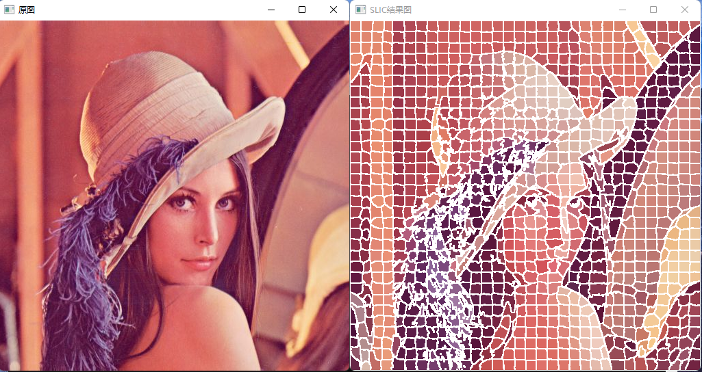

# SLIC - Simple Linear Iterative Clustering

[](https://github.com/Razirp) [](https://github.com/Razirp/SLIC_Simple-Linear-Iterative-Clustering/blob/main/LICENSE) [](https://cppreference.com/) []()  [](https://github.com/Razirp/SLIC_Simple-Linear-Iterative-Clustering/stargazers)

> 本存储库是作者进行 SLIC 算法复现实验时的源码，以下是相应的实验报告。



## 一、实验原理

- 超像素算法将像素组合成感知有意义的**原子区域**，可以用于**替换像素网格**的刚性结构。

  - “原子区域”即超像素
  - 便于图像处理，经常作为图像处理的预处理步骤

- 判断算法优劣性的普遍性质：

  - 超像素应当很好地贴合图像边界
  - 当被用作降低计算复杂度的预处理步骤时，超像素应当具有计算迅速、存储高效、使用简单的特点
  - 当被用作图像分割目的时，超像素应当既能够提升速度也能够提高结果的质量

  > 速度、连接图像边界的能力、分割性能

### 简单线性迭代聚类（SLIC, Simple Linear Iterative Clustering）

- SLIC 是 k-means 用于超像素生成的一种适应方法，与其他算法相比具有两个重要区别：

  - 算法通过将搜索空间限制为与超像素大小成比例的区域，显著地减少了优化中的距离计算的数量。这将复杂度降低到了与像素数量 $N$ 成线性关系的水平，而与超像素的数量 $k$ 无关。

  - 加权的距离度量结合了颜色和空间邻近性，从而同时提供了对超像素的大小和紧凑性的控制。

#### 1. 算法

- 默认情况下，算法的唯一参数是超像素个数 $k$
- 初始聚类中心大致均匀分布在图像中，网格间隔为 $S=\sqrt{\frac{N}{k}}$
- 每个聚类中心只搜索其 $2s\times 2s$ 邻域内的像素点
  - 这使得该算法的复杂度降低到了与像素数量 $N$ 成线性关系的水平

算法步骤如下：

1. 初始化算法：

   1. 以步长 $S=\sqrt{\frac{N}{k}}$ 对像素进行采样，初始化聚类中心 $C_{k}=\begin{bmatrix} l_{k} & a_{k} & b_{k} & x_{k} & y_{k} \end{bmatrix}^{T}$ 
   2. 移动聚类中心至其 $3\times 3$ 邻域中的梯度最小位置
   3. 对每一个像素，设置聚类标签 $L(i)=-1$ 和距离 $d(i)=\infty$

2. 重复以下步骤：

   1. 对每一个聚类中心 $C_{k}$，计算其 $2s\times 2s$ 邻域内的每一个像素 $i$ 到它的距离 $D$
      - 如果距离 $D<d(i)$，则更新 $d(i)=D$，并设置聚类标签 $L(i)=k$
   2. 计算新的聚类中心，将其设为属于该聚类的所有像素的平均向量
   3. 计算残差 $E$，取为新聚类中心与先前聚类中心的 L2 范数距离和

   直到残差 $E\le 阈值$。

   > 对于绝大多数图像，10次迭代就足够了

#### 2. 距离测量

距离 $D$ 综合了颜色距离 $d_{c}$ 和空间距离 $d_{s}$，其中：

- $d_{c}=\sqrt{\Delta l^{2}+\Delta a^{2}+\Delta b^{2}}$

  > 灰度图像中只需考虑 $\Delta l$

- $d_{s}=\sqrt{\Delta x^{2}+\Delta y^{2}}$

  > 也可以扩展到三维

- $D=\sqrt{d_{c}^{2}+(\frac{d_{s}}{S})^{2}m^{2}}$

  - $m$ 为常数，它允许我们权衡颜色邻近性和空间邻近性之间的权重：
    - 当 $m$ 大时，空间邻近性更重要，所得的超像素更紧凑
    - 当 $m$ 小时，颜色邻近性更重要，所得的超像素更紧密地粘附到图像边界，但是具有较小的规则尺寸和形状
  - 当使用 CIELAB 色彩空间时，$m$ 可以取 $[1,40]$ 范围内的值

## 二、实验步骤

### 2.1 了解实验原理

阅读论文 [1] 并参考相关网络博客，了解 SLIC 的实现原理。

### 2.2 配置 OpenCV 环境

参考网络博客和官方文档，在电脑上配置了 `OpenCV` 的环境。

### 2.3 算法代码编写

#### 基本定义

为了便于编写和阅读，笔者将 `SLIC` 算法的实现封装在了 `SLIC` 类中。其基本的定义如下：

```c++
class SLIC
{
private:
	Mat srcImage;		//待处理的图像
	int numOfSuperpixels;		//超像素的个数
	int numOfPixels;	//图像像素总数
	int step;		//网格间隔
	int step2;		//网格间隔的平方

	Point2i* superpixels;	//存储每一个超像素的坐标
	int** labels;	//每一个单元[y,x]存储像素点(y,x)所属的聚类中心
	int** distance2;	//每一个单元[y,x]存储像素点(y,x)到其聚类中心的距离的平方（起到距离的作用）

	bool processed;		//指示是否已进行过SLIC处理

public:

	SLIC(Mat src);	//src要求为BGR格式

	SLIC(Mat src, int k);	//src为待处理图像（BGR格式），k为预期超像素数
	Mat getResult();	//返回BGR格式的结果图像
	~SLIC();

private:
	void init(Mat src, int numOfSuperpixels);	//初始化函数
	int calcDistance2(int x, int y, int superpixelIndex);	//计算点(x,y)与超像素(superpixelIndex)之间的距离的平方
	void updatePixels();	//更新每个像素点的聚类中心归属及其距离
	bool updateClusteringCenter();	//更新聚类中心，返回值指示聚类中心是否发生改变
	void doSLIC();	//进行SLIC算法处理

};
```

#### 初始化

方法 `init()` 将对 `SLIC` 类进行初始化，并完成 `SLIC` 算法中的初始化部分。其主要功能如下：

- 将图像转化为 `Lab` 格式并保存

- 初始化各字段

- 初始化各超像素聚类中心，使之均匀分布在整个图像上

- 设置聚类标签 `Labels[y][x] = -1` 和**距离的平方** `distance2[y][x] = -1`

  > 用距离的平方代替距离，在效果相同的情况下，省去了开根号运算的步骤

```c++
void SLIC::init(Mat src, int k)
{
	processed = false;
	cvtColor(src, srcImage, COLOR_BGR2Lab);	//将源图像转化为Lab格式并分配给srcImage字段
	this->numOfPixels = srcImage.rows * srcImage.cols;	//初始化像素数
	this->step2 = numOfPixels / k;	//初始化超像素步长的平方
	this->step = sqrt(step2);	//初始化超像素步长
	int numOfSuperpixels_row = round((double)srcImage.rows / step);	//超像素行数取行像素数与步长的比值（四舍五入）
	int numOfSuperpixels_col = round((double)srcImage.cols / step);	//超像素列数取列像素数与步长的比值（四舍五入）
	this->numOfSuperpixels = numOfSuperpixels_col * numOfSuperpixels_row;	//初始化超像素数

	//申请数组内存
	labels = new int* [srcImage.rows];
	distance2 = new int* [srcImage.rows];
	for (int i = 0; i < srcImage.rows; ++i)
	{
		labels[i] = new int[srcImage.cols];
		distance2[i] = new int[srcImage.cols];
		//初始化每一个点的Label和distance为-1
		memset(labels[i], -1, srcImage.cols * sizeof(int));
		memset(distance2[i], -1, srcImage.cols * sizeof(int));
	}

	superpixels = new Point2i[this->numOfSuperpixels];
	if (labels == NULL || distance2 == NULL || superpixels== NULL)
	{	//分配内存失败则程序故障退出
		exit(-1);
	}
	
	//初始化超像素坐标
	for (int i = 0; i < numOfSuperpixels_row; ++i)
	{	//对每一超像素行
		int rowNow = step / 2 + i * step;	//当前超像素行的超像素的行坐标
		for (int j = 0; j < numOfSuperpixels_col; ++j)
		{
			superpixels[i * numOfSuperpixels_col + j] = Point2i(step / 2 + j * step, rowNow);		//存储当前超像素的坐标（横x纵y）
		}
	}
}
```

#### 像素点间的距离计算

方法 `calcDistance2(int x, int y, int superpixelIndex)` 用于计算点 `(x,y)` 和第 `superpixelIndex` 个超像素聚类中心之间的距离（的平方）：

> 这里权重 m 取 40，即代码中权重的平方 m2 = 1600。
>
> 该权重可以根据需要调整。

```c++
int SLIC::calcDistance2(int x, int y, int superpixelIndex)
{
	const int m2 = 1600;		//权重的平方

	int dl = srcImage.at<Vec3b>(superpixels[superpixelIndex].y, superpixels[superpixelIndex].x).val[0] - srcImage.at<Vec3b>(y, x).val[0];
	int da = srcImage.at<Vec3b>(superpixels[superpixelIndex].y, superpixels[superpixelIndex].x).val[1] - srcImage.at<Vec3b>(y, x).val[1];
	int db = srcImage.at<Vec3b>(superpixels[superpixelIndex].y, superpixels[superpixelIndex].x).val[2] - srcImage.at<Vec3b>(y, x).val[2];
	int dx = superpixels[superpixelIndex].x - x;
	int dy = superpixels[superpixelIndex].y - y;

	int dc2 = dl * dl + da * da + db * db;	//dc的平方
	int ds2 = dx * dx + dy * dy;	//ds的平方

	int distance2 = dc2 + (ds2 * m2) / step2;	//依照公式计算距离的平方
	return distance2;
}
```

#### 更新每个像素点的聚类标签和距离

方法 `updatePixels()` 用于在每一次迭代循环中更新每个像素点的聚类标签，并分别计算它们与各自聚类中心的距离（的平方）：

```c++
void SLIC::updatePixels()
{
	for (int i = 0; i < numOfSuperpixels; ++i)
	{	//对于每个超像素
		//扫描其周围2step×2step范围内的像素点
		for (int dx = -step; dx <= step; ++dx)
		{
			int nowX = superpixels[i].x + dx;	//当前扫描到的像素点的x坐标
			if (nowX < 0 || nowX >= srcImage.cols)
			{	//如果超出图像边界，则跳过
				continue;
			}
			for (int dy = -step; dy <= step; ++dy)
			{
				int nowY = superpixels[i].y + dy;	//当前扫描到的像素点的y坐标
				if (nowY < 0 || nowY >= srcImage.rows)
				{	//如果超出图像边界，则跳过
					continue;
				}
				//若当前像素点合法，则进行以下操作
				int newDis2 = calcDistance2(nowX, nowY, i);	//计算当前像素点到第i个超像素中心的距离平方
				if (newDis2 < distance2[nowY][nowX] || distance2[nowY][nowX] == -1)
				{	//如果新距离更小或者距离为缺省值(-1)，则更新距离和标签label
					distance2[nowY][nowX] = newDis2;
					labels[nowY][nowX] = i;		//更新聚类中心为i
				}
			}
		}
	}
}
```

#### 更新聚类中心

方法 `updateClusteringCenter()` 用于在每次迭代中更新各聚类中心的位置：

```c++
bool SLIC::updateClusteringCenter()
{
	bool changed = false;	//指示聚类中心是否发生改变
	//申请数组并初始化为0
	int* sumCount = new int[numOfSuperpixels]();	//记录每个聚类中点的个数
	int* sumX = new int[numOfSuperpixels]();	//记录每个聚类中点的x坐标和
	int* sumY = new int[numOfSuperpixels]();	//记录每个聚类中点的y坐标和
	if (sumCount == NULL || sumX == NULL || sumY == NULL)
	{	//分配内存失败则程序故障退出
		exit(-1);
	}

	//遍历图像，计算上述三个量
	for (int y = 0; y < srcImage.rows; ++y)
	{
		for (int x = 0; x < srcImage.cols; ++x)
		{
			int nowCenter = labels[y][x];	//当前像素的聚类中心
			++sumCount[nowCenter];
			sumX[nowCenter] += x;
			sumY[nowCenter] += y;
		}
	}
	//更新聚类中心的坐标值
	for (int i = 0; i < numOfSuperpixels; ++i)
	{
		//新的聚类中心坐标取聚类中所有点的坐标的平均值
		int newX = sumX[i] / sumCount[i];
		int newY = sumY[i] / sumCount[i];
		if (newX != superpixels[i].x || newY != superpixels[i].y)
		{	//若坐标值发生变化
			superpixels[i] = Point2i(newX, newY);	//更新坐标值
			changed = true;		//指示聚类中心已发生改变
		}
	}

	delete[] sumY;
	delete[] sumX;
	delete[] sumCount;
	return changed;
}
```

#### SLIC 算法主干

方法 `doSLIC()` 综合调用上述方法实现 `SLIC` 算法的主干部分：

```c++
void SLIC::doSLIC()
{
	processed = true;
	const int maxIterateNums = 20;	//设置最大迭代数
	for (int i = 0; i < maxIterateNums; ++i)
	{
		updatePixels();
		bool changed = updateClusteringCenter();
		if (!changed)
		{	//如果前后两次迭代的聚类中心没有发生变化，则认为迭代收敛终止，退出循环
			break;
		}
	}
}
```

#### 返回结果图像

方法 `getResult()` 将生成一个标识出超像素边界的 `BGR` 格式结果图并将其返回：

```c++
Mat SLIC::getResult()
{
	if (!processed)
	{	//如果未处理过，则进行SLIC处理
		doSLIC();	
	}
	Mat resultImage = srcImage.clone();	//结果图

	//计算每个聚类的Lab平均值
	int* sumCount = new int[numOfSuperpixels]();	//记录每个聚类中点的个数
	int* averL = new int[numOfSuperpixels]();	//记录每个聚类中点的L的平均值
	int* averA = new int[numOfSuperpixels]();	//记录每个聚类中点的a的平均值
	int* averB = new int[numOfSuperpixels]();	//记录每个聚类中点的b的平均值
	if (sumCount == NULL || averL == NULL || averA == NULL || averB == NULL)
	{	//分配内存失败则程序故障退出
		exit(-1);
	}

	//遍历图像，计算上述四个量
	for (int y = 0; y < srcImage.rows; ++y)
	{	//加和
		for (int x = 0; x < srcImage.cols; ++x)
		{
			int nowCenter = labels[y][x];	//当前像素的聚类中心
			++sumCount[nowCenter];
			averL[nowCenter] += srcImage.at<Vec3b>(y, x)[0];
			averA[nowCenter] += srcImage.at<Vec3b>(y, x)[1];
			averB[nowCenter] += srcImage.at<Vec3b>(y, x)[2];
		}
	}
	for (int i = 0; i < numOfSuperpixels; ++i)
	{	//取平均
		averL[i] /= sumCount[i];
		averA[i] /= sumCount[i];
		averB[i] /= sumCount[i];
	}
	delete[] sumCount;

	//将图像中每个点的Lab值更改为其相应聚类的Lab值的均值，并将边界设为纯白
	for (int y = 0; y < resultImage.rows; ++y)
	{
		for (int x = 0; x < resultImage.cols; ++x)
		{
			int nowCenter = labels[y][x];
			//检测是否为边界，若周围edgeWidth×edgeWidth邻域内发生label变化，则认为是边界
			bool edgeFlag = false;
			const int edgeWidth = 1;
			for (int dx = -edgeWidth; dx <= edgeWidth && !edgeFlag; dx++)
			{
				for (int dy = -edgeWidth; dy <= edgeWidth && !edgeFlag; ++dy)
				{
					int nowX = x + dx;	//当前扫描到的像素点的x坐标
					int nowY = y + dy;	//当前扫描到的像素点的y坐标
					if (nowY < 0 || nowY >= srcImage.rows)
					{	//如果在图像边缘，则认为是边界
						edgeFlag = true;
					}
					else if (labels[nowY][nowX] != nowCenter)
					{	//如果有label变化，则认为是边界
						edgeFlag = true;
					}
				}
			}
			if (edgeFlag)
			{	//如果是边缘，则更新颜色为纯白色
				resultImage.at<Vec3b>(y, x)[0] = 255;
				resultImage.at<Vec3b>(y, x)[1] = 128;
				resultImage.at<Vec3b>(y, x)[2] = 128;
			}
			else
			{	//如果不是边缘，则更新颜色为相应聚类Lab的均值
				resultImage.at<Vec3b>(y, x)[0] = averL[nowCenter];
				resultImage.at<Vec3b>(y, x)[1] = averA[nowCenter];
				resultImage.at<Vec3b>(y, x)[2] = averB[nowCenter];
			}
		}
	}
	delete[] averB;
	delete[] averA;
	delete[] averL;

	cvtColor(resultImage, resultImage, COLOR_Lab2BGR);	//改变图像为BGR格式
	return resultImage;
}
```

### 2.4 算法测试

编写代码调用 `SLIC` 算法进行图像处理：

```c++
// main.cpp : 此文件包含 "main" 函数。程序执行将在此处开始并结束。
#include "SLIC.h"

int main(int argc, char* argv[])
{
    cout << "请输入图片路径(输入0表示取缺省图片路径）：" << endl;
    string url;
    cin >> url;
    if (url == "0")
    {
        url = "./images/63536f2f01409f750162828a980a0380_720w.jpg";
    }
    Mat image = imread(url, IMREAD_COLOR);
    if (image.empty())
    {   
        fprintf(stderr, "Can't load image!\n");
        return -1;
    }
    cout << "请输入预期超像素个数k（输入0或负数则表示取缺省值）：" << endl;
    int k;
    cin >> k;
    if (k <= 0)
    {
        k = 1024; //k缺省值为1024
    }
    
    SLIC slic(image, k);
    Mat resultImage = slic.getResult();

    imwrite("./result.jpg", resultImage);   //保存结果图像
    //显示原图和结果图
    namedWindow("原图", WINDOW_AUTOSIZE);
    namedWindow("SLIC结果图", WINDOW_AUTOSIZE);
    imshow("原图", image);
    imshow("SLIC结果图", resultImage);
    waitKey(0);
    image.release();
    resultImage.release();
    return 0;
}
```

该程序将从用户处获得待处理图像的路径和预期的超像素数，经处理后显示原图和处理后的图像，并将处理后的图像以 `result.jpg` 保存在程序根目录下。

## 三、实验结果与分析

算法中可人为调整的参数有超像素的个数 $k$ 和计算距离时公式 $D=\sqrt{d_{c}^{2}+(\frac{d_{s}}{S})^{2}m^{2}}$ 中的权重 $m$。其中 $k$ 可以在用户输入时指定；$m$ 则是通过在代码中修改 `calcDistance2()` 方法下的常量 `m2` 的值来指定。注意 `m2` 是指权重 $m$ 的平方。

### 3.1 运行示例

运行程序，输入图片路径和预期超像素个数：


运行结果如下（此时 m = 40）：


可以看到，SLIC 结果图很好地按照预期数量划分出了超像素，实现了预期的功能。

### 3.2 不同参数下结果的对比

- k = 128，m = 10


- k = 128，m = 40


- k = 1024 ，m = 10


- k = 1024，m = 40


- k = 2048，m = 10


- k = 2048，m = 40


通过对比可以看出：

- 在权重 $m$ 不变的情况下：
  - 超像素的数量 $k$ 越大，所得的图像越清晰
  - 超像素的数量 $k$ 越小，所得的图像越模糊
- 在超像素的数量 $k$ 不变的情况下：
  - 权重 $m$ 越大，所得的超像素越紧凑
  - 权重 $m$ 越小，所得的超像素越紧密地粘附到图像边界，但是具有较小的规则尺寸和形状

以上行为均符合实验的预期，说明实验基本成功。

## 附录——代码运行方式

### 实验环境

- OpenCV - 4.5.5 Release
- Windows 11 专业版 21H1
- Microsoft Visual Studio Community 2022 (64 位)  版本 17.0.1

### 运行方式

本实验利用了 OpenCV 2 以上版本中的一些定义和函数，请确保运行的机器上配置了相应的环境。

#### 在 Microsoft Visual Studio 中运行

在 `Microsoft Visual Studio` 中打开项目根目录下的 `SLIC.sln` 以打开项目。在配置好 OpenCV 的运行环境后，可以利用 `Microsoft Visual Studio` 提供的功能对程序进行编译、调试和运行。

#### 直接编译运行

项目共包括 `SLIC.h` 、`SLIC.cpp` 和 `main.cpp` 三个源文件。理论上在配置好相应的 OpenCV 编译环境后，可以利用任意主流 `C++` 编译器对源文件进行编译运行。但笔者并未实际尝试过此种方式，仅供参考。

### 关于缺省图像和缺省值

- 程序中所提到的“缺省图像”指 `images` 文件夹下的 `63536f2f01409f750162828a980a0380_720w.jpg` Lena 图。若希望使用该缺省图像必须保证 `./images` 路径下存在该图片。
- 缺省的超像素数 `k = 1024`

## 参考文献

1. Radhakrishna Achanta, Appu Shaji, Kevin Smith, Aurelien Lucchi, Pascal Fua, and Sabine Süsstrunk, SLIC Superpixels Compared to State-of-the-art Superpixel Methods, IEEE Transactions on Pattern Analysis and Machine Intelligence, vol. 34, num. 11, p. 2274 – 2282, May 2012. Citation~6780
