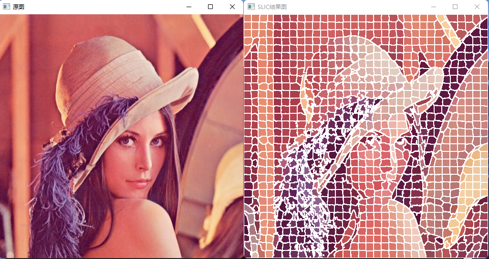
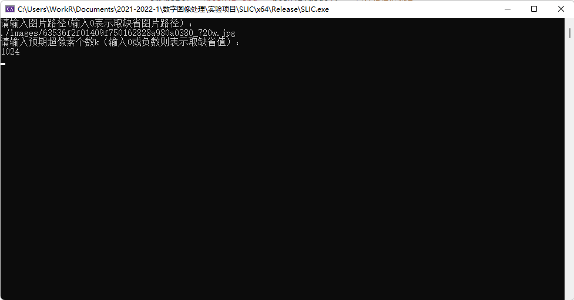
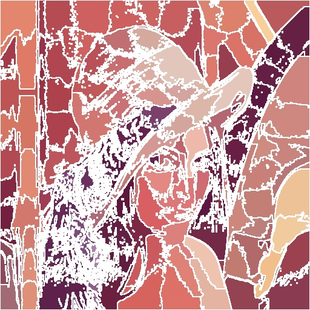
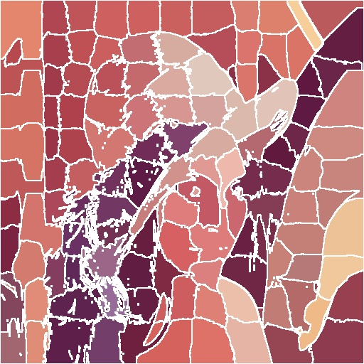
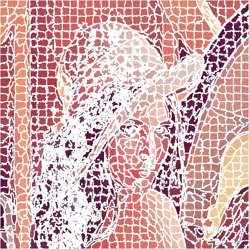
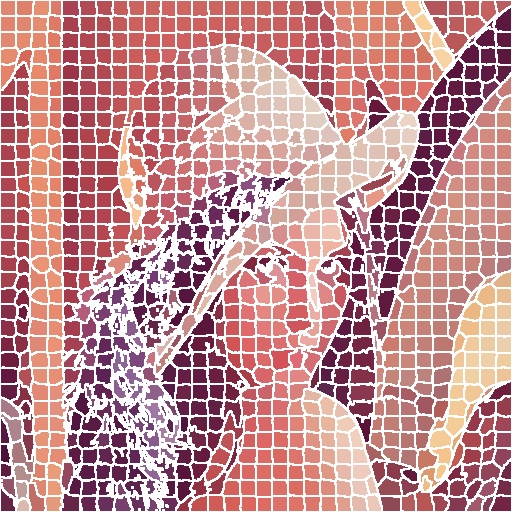
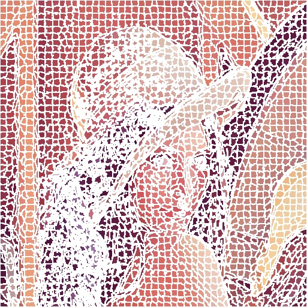
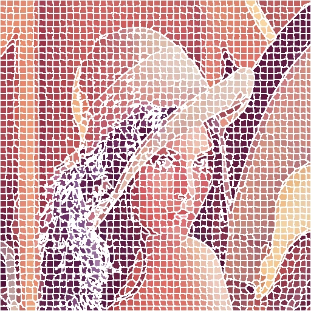

# SLIC - Simple Linear Iterative Clustering

[](https://github.com/Razirp) [](https://github.com/Razirp/SLIC_Simple-Linear-Iterative-Clustering/blob/main/LICENSE) [](https://cppreference.com/) [](https://opencv.org) [](https://blog.csdn.net/qq_45899276/article/details/138095302?csdn_share_tail=%7B%22type%22%3A%22blog%22%2C%22rType%22%3A%22article%22%2C%22rId%22%3A%22138095302%22%2C%22source%22%3A%22qq_45899276%22%7D)  [](https://github.com/Razirp/SLIC_Simple-Linear-Iterative-Clustering/stargazers)

📖 中文版点[这儿](README.md)！

> This repository contains the source code for the author's experimental reproduction of the SLIC algorithm, along with the corresponding experimental report.



## I. Experimental Principle
Superpixel algorithms group pixels into perceptually meaningful atomic regions that can replace the rigid structure of the pixel grid.
- "Atomic regions" refer to superpixels.
- They are convenient for image processing and are often used as a preprocessing step.
- Common properties to judge the quality of an algorithm:
  - Superpixels should fit the image boundaries well.
  - When used as a preprocessing step to reduce computational complexity, superpixels should be computationally fast, storage-efficient, and easy to use.
  - When used for the purpose of image segmentation, superpixels should both improve speed and the quality of the results.
  - Speed, ability to connect image boundaries, segmentation performance.

### Simple Linear Iterative Clustering (SLIC)
SLIC is an adaptive method of k-means for superpixel generation, with two important distinctions compared to other algorithms:
- The algorithm significantly reduces the number of distance calculations in optimization by limiting the search space to an area proportional to the size of the superpixels. This reduces the complexity to a linear relationship with the number of pixels \( N \), independent of the number of superpixels \( k \).
- A weighted distance measure combines color and spatial proximity, providing control over both the size and compactness of the superpixels.

#### 1. Algorithm
By default, the only parameter of the algorithm is the number of superpixels \( k \).
- Initial cluster centers are roughly uniformly distributed across the image with a grid spacing of \( S = \sqrt{\frac{N}{k}} \).
- Each cluster center only searches for pixel points within its \( 2s \times 2s \) neighborhood.
- This reduces the algorithm's complexity to a linear relationship with the number of pixels \( N \).

#### Algorithm Steps:
- Initialization:
  - Sample pixels with a step size \( S = \sqrt{\frac{N}{k}} \) to initialize cluster centers \( C_{k} = [l_{k} a_{k} b_{k} x_{k} y_{k}]^{T} \).
  - Move cluster centers to the position of minimum gradient within their \( 3 \times 3 \) neighborhood.
  - For each pixel, set the cluster label \( L(i) = -1 \) and distance \( d(i) = \infty \).
- Repeat the following steps:
  - For each cluster center \( C_{k} \), calculate the distance \( D \) for each pixel \( i \) within its \( 2s \times 2s \) neighborhood.
  - If the distance \( D < d(i) \), update \( d(i) = D \) and set the cluster label \( L(i) = k \).
  - Calculate new cluster centers as the average vector of all pixels belonging to that cluster.
  - Calculate the residual \( E \) as the L2 norm distance between the new and previous cluster centers.
  - Continue until the residual \( E \leq \) threshold.
  - For most images, 10 iterations are sufficient.

#### 2. Distance Measurement
The distance \( D \) combines color distance \( d_{c} \) and spatial distance \( d_{s} \), where:
- \( d_{c} = \sqrt{\Delta l^{2} + \Delta a^{2} + \Delta b^{2}} \)
  - For grayscale images, only consider \( \Delta l \).
- \( d_{s} = \sqrt{\Delta x^{2} + \Delta y^{2}} \)
  - It can also be extended to three dimensions.
- \( D = \sqrt{d_{c}^{2} + \left(\frac{d_{s}}{S}\right)^{2} m^{2}} \)
- \( m \) is a constant that allows us to balance the weight between color proximity and spatial proximity:
  - When \( m \) is large, spatial proximity is more important, resulting in more compact superpixels.
  - When \( m \) is small, color proximity is more important, resulting in superpixels that adhere more closely to image boundaries but have smaller regular sizes and shapes.
  - When using the CIELAB color space, \( m \) can take values in the range of \( [1, 40] \).

## II. Experimental Steps
2.1 Understand the Experimental Principle
- Read the paper [1] and refer to relevant online blogs to understand the implementation principle of SLIC.

2.2 Configure the OpenCV Environment
- Refer to online blogs and official documentation to set up the OpenCV environment on your computer.

2.3 Algorithm Code Writing
- Basic Definition
  - To facilitate writing and reading, the author encapsulates the implementation of the SLIC algorithm in the SLIC class. The basic definition is as follows:

```c++
class SLIC {
private:
    Mat srcImage;       // The image to be processed
    int numOfSuperpixels;       // The number of superpixels
    int numOfPixels;    // The total number of image pixels
    int step;       // Grid spacing
    int step2;      // The square of the grid spacing

public:
    // Initialization function
    void init(Mat src, int numOfSuperpixels);
    // Calculate the square of the distance between point (x, y) and superpixel (superpixelIndex)
    int calcDistance2(int x, int y, int superpixelIndex);
    // Update the cluster center attribution and distance for each pixel
    void updatePixels();
    // Update the clustering center, return value indicates whether the clustering center has changed
    bool updateClusteringCenter();
    // Perform SLIC algorithm processing
    void doSLIC();

    // Additional methods and members...
};
```

- Initialization
  - The `init()` method initializes the SLIC class and completes the initialization part of the SLIC algorithm. Its main functions include:
    - Converting the image to the Lab format and saving it
    - Initializing various fields
    - Initializing superpixel cluster centers to be evenly distributed across the entire image
    - Setting cluster labels `Labels[y][x] = -1` and the square of distances `distance2[y][x] = -1`
    - Using the square of the distance instead of the distance to save the step of calculating the square root

- Pixel Distance Calculation
  - The `calcDistance2(int x, int y, int superpixelIndex)` method calculates the distance (square) between point (x, y) and the superpixel cluster center of index `superpixelIndex`.

- Updating Pixel Labels and Distances
  - The `updatePixels()` method updates the cluster label for each pixel and calculates their distances (squares) from their respective cluster centers during each iteration loop.

- Updating Cluster Centers
  - The `updateClusteringCenter()` method updates the positions of the cluster centers during each iteration.

- SLIC Algorithm Main Body
  - The `doSLIC()` method integrates the above methods to implement the main part of the SLIC algorithm.

- Returning the Result Image
  - The `getResult()` method generates and returns a BGR format result image that identifies the boundaries of the superpixels.

2.4 Algorithm Testing
- Write code to call the SLIC algorithm for image processing.

```c++
// main.cpp: This file contains the "main" function. Program execution begins and ends here.

#include "SLIC.h"

int main(int argc, char* argv[]) {
    cout << "Please enter the image path (enter 0 for the default image path):" << endl;
    string url;
    cin >> url;
    if (url == "0") {
        url = "./images/63536f2f01409f750162828a980a0380_720w.jpg";
    }
    Mat image = imread(url, IMREAD_COLOR);
    if (image.empty()) {
        fprintf(stderr, "Can't load image!\n");
        return -1;
    }
    cout << "Please enter the desired number of superpixels k (enter 0 or a negative number for the default value):" << endl;
    int k;
    cin >> k;
    if (k <= 0) {
        k = 1024; // Default value for k is 1024
    }

    // Additional code for processing and displaying the image...
}
```

The program will obtain the path of the image to be processed and the expected number of superpixels from the user. After processing, it will display the original and processed images, and save the processed image as `result.jpg` in the root directory of the program.

## III. Experimental Results and Analysis
Adjustable parameters in the algorithm include the number of superpixels \( k \) and the weight \( m \) in the distance formula \( D = \sqrt{d_{c}^{2} + \left(\frac{d_{s}}{S}\right)^{2} m^{2}} \). \( k \) can be specified when the user inputs; \( m \) is specified by modifying the value of the constant `m2` in the `calcDistance2()` method, where `m2` is the square of the weight \( m \). Note that the behavior of the algorithm is consistent with expectations, indicating that the experiment was basically successful.

### 3.1 Running Example
Run the program, input the image path, and the expected number of superpixels:



The results are as follows (with \( m = 40 \)):


The SLIC result image successfully divided the superpixels as expected according to the desired number, fulfilling the intended function.

### 3.2 Comparison of Results Under Different Parameters

- k = 128，m = 10

	

- k = 128，m = 40

	

- k = 1024 ，m = 10

	

- k = 1024，m = 40

	

- k = 2048，m = 10

	

- k = 2048，m = 40

	

It can be observed that:
- With the weight \( m \) unchanged:
  - The larger the number of superpixels \( k \), the clearer the resulting image.
  - The smaller the number of superpixels \( k \), the more blurred the resulting image.
- With the number of superpixels \( k \) unchanged:
  - The larger the weight \( m \), the more compact the superpixels.
  - The smaller the weight \( m \), the more closely the superpixels adhere to the image boundaries, but with smaller regular sizes and shapes.

## Appendix - Code Running Instructions
### Experimental Environment
- OpenCV - 4.5.5 Release
- Windows 11 Pro 21H1
- Microsoft Visual Studio Community 2022 (64-bit) Version 17.0.1

### Running Instructions
This experiment utilizes some definitions and functions from OpenCV version 2 and above. Please ensure that the machine running the experiment has the appropriate environment configured.

- Running in Microsoft Visual Studio
  - Open the `.sln` file in the root directory of the project in Microsoft Visual Studio. After setting up the OpenCV runtime environment, you can use the features provided by Microsoft Visual Studio to compile, debug, and run the program.

- Direct Compilation and Execution
  - The project includes three source files: `SLIC.h`, `SLIC.cpp`, and `main.cpp`. In theory, after setting up the corresponding OpenCV compilation environment, you can compile and run the source files using any mainstream C++ compiler. However, the author has not actually tried this method and provides it for reference only.

### About Default Images and Default Values
- The "default image" mentioned in the program refers to the Lena image located in the `images` folder at the path `63536f2f01409f750162828a980a0380_720w.jpg`. To use this default image, ensure that the image exists at the specified path.
- The default number of superpixels \( k = 1024 \).

### References
Radhakrishna Achanta, Appu Shaji, Kevin Smith, Aurelien Lucchi, Pascal Fua, and Sabine Süsstrunk, "SLIC Superpixels Compared to State-of-the-art Superpixel Methods," IEEE Transactions on Pattern Analysis and Machine Intelligence, vol. 34, no. 11, pp. 2274–2282, May 2012. Citation~6780

### License
This project is licensed under the MIT License - see the `LICENSE` file for details.

### Contact
For any questions or inquiries, please contact me at razirp77@outlook.com.
